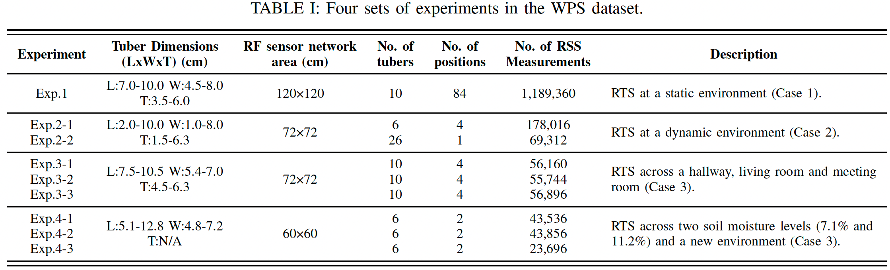
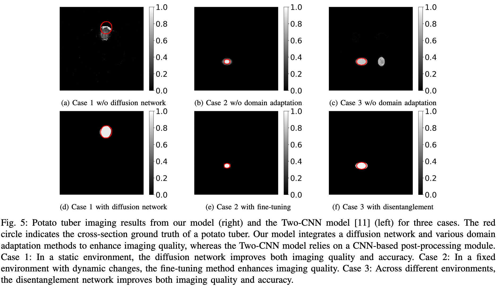

# MC_Diffusion
We introduce a data-driven root tuber sensing (RTS) framework that uses the received signal strength (RSS) data from a radio frequency (RF) sensor network to reconstruct cross-section images of root tubers in soils. First, we perform extensive experiments with our data acquisition system in various environments to build a wireless potato sensing (WPS) dataset. Then, we propose a novel deep neural network model, MC-Diffusion, which integrates multi-branch convolutional neural networks with a latent diffusion neural network to enable fine-grained image reconstruction of root tubers. In addition, to mitigate interference from multipath effects, we introduce two domain adaptation methods for MC-Diffusion: one-shot fine-tuning for online model updating and disentangled representation learning (DRL) for transferring pretrained models to unseen environments. Finally, we extensively evaluate the imaging capabilities of MC-Diffusion across multiple scenarios, including root tuber imaging in a static environment (Case 1), robust imaging under environmental changes (Case 2), and cross-environment and cross-soil imaging for underground tubers (Case 3).

  

For data collection, we design a testbed, Spin, which consists of an RF sensor network with 16 sensor nodes, two types of containers, a rotating platform, and an RGB camera. The large container contains soil with predefined locations to insert one or more small containers. Potato tubers with different dimensions are buried in different small containers with soil. By placing the “nesting containers” on a rotating platform and rotating the platform with various predefined angles, root tubers can be located at various positions and orientations within the sensing area. In addition, we use a stick with a colored marker, which is captured by the RGB camera to generate the ground truth.  

  

To evaluate the performance of our RTS framework, we construct a comprehensive dataset, WPS, consisting of data from a static environment (Case 1), an environment with dynamic changes (Case 2), and multiple environments and soil moisture conditions (Case 3).

  

Some visualization reuslts of MC-Diffusion and baselin methods are shown below. For illustration, we present imaging results from a static environment, a fixed environment with dynamic changes, and across multiple environments. 

  

The raw dataset has been publicly released. Both the dataset and code for data pre-processing are accessible at [https://ieee-dataport.org/documents/underground-root-tuber-sensing-wireless-networks](https://ieee-dataport.org/documents/underground-root-tuber-sensing-wireless-networks). In addition, we have released the pre-trained model and part of the corresponding data files in releases, which can be used for performance testing. 
